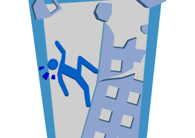
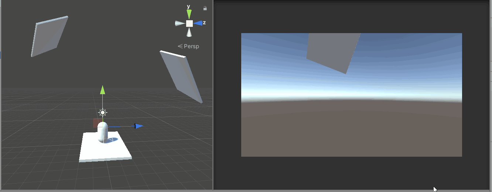
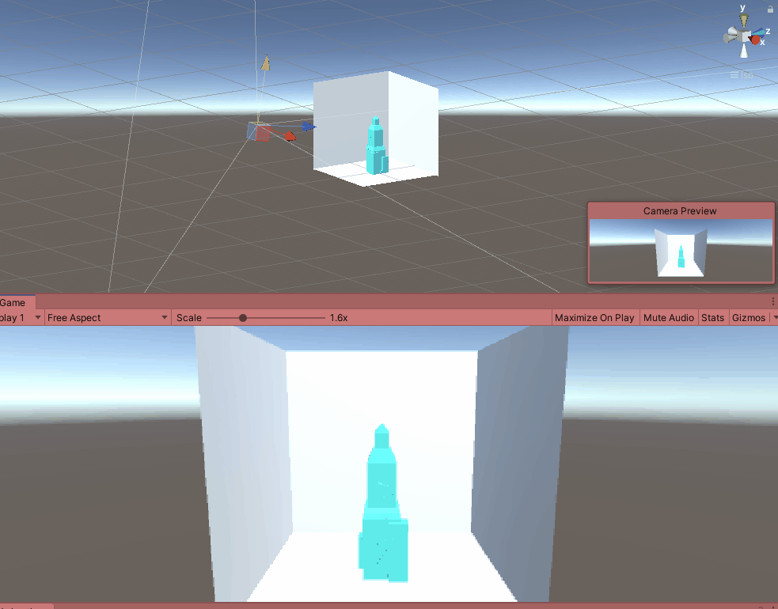

# Reverse

Reverse is a 3D based first person platform game where you climb a shattered building by jumping from rubble to rubble while the building is reversed to its original state in a few seconds.

# TODO when adding new level

- 1) tag meshes as platform
- 2) player layermask everything
- 3) editor in editorfolder
